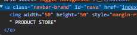

# Google.com Get Number Of Search Results For Query

For this example we'll be creating a simple Google auto-searcher that grabs the total number of results for a query & the time take to execute the query.

<figure><figcaption></figcaption></figure>

First, we'll create a function that takes in a search query and prints the number of results found + time taken to execute the query:

```python
from simpleseleniumwrapper import WebDriver as SimpleSelenium #Imports Simple Selenium

def getNumberOfSearchResultsForQuery(query):
    #... Code for this example will go here
```

Now inside the function let's initiate the Simple Selenium Webdriver:

```python
#Init Simple Selenium driver
driver=SimpleSelenium("chrome",maximized=True,save_profile=True,profile_name="google autosearcher")
```

Visit google.com:

```python
driver.visit("https://www.google.com/") #Visit google.com
```

Looking at the search bar for google.com, I notice that the tag is a "textarea", which is a fairly uncommon element on most webpages. Let's try using the textarea to locate the search bar element:

```python
search_bar=driver.by_tag("textarea") #Grabs the first instance of <textarea>
```

Now we need Simple Selenium to type in the search query. Luckily Simple Selenium has the .write function, which will automatically type text like a human:

```python
search_bar.write(query) #Writes the query into the search bar with human-like keystrokes
```

After typing, we need to hit the enter key:

```python
driver.actionChains.press_key("enter").perform() #Use action chains to hit enter key
```

Once Simple Selenium hits the enter key, it's time to grab the number of results returned text from the results page.&#x20;

Looking at the page, the results returned text has an ID "result-stats" that we can use to grab the text element:

<figure><figcaption></figcaption></figure>

Let's use that ID to locate the number of results found text on the page:

```python
number_of_search_results=driver.by_id("result-stats").text() #Grabs the "About x results" text
```

The last step is dissecting the text & grabbing valuable information. We can use Python's .split function to do this:

```python
#Split number of results into results number + time taken to execute query
total_number_results_clean=number_of_search_results.split("About ")[1].split(" ")[0]
time_taken_for_query=number_of_search_results.split("(")[1].split(" ")[0]
```

Now let's print the number of results found & time taken for the query:

```python
#Prints data with formatted strings
print(f"Found {total_number_results_clean} results for \"{query}\" on google.com")
print(f"Query took {time_taken_for_query} seconds")
```

And finally, close the Webdriver cleanly:

```python
driver.close() #Close driver cleanly
```

The entire function code looks like this:

```python
def getNumberOfSearchResultsForQuery(query):
    #Init Simple Selenium driver
    driver=SimpleSelenium("chrome",maximized=True,save_profile=True,profile_name="awesome sauce")

    driver.visit("https://www.google.com/") #Visit google.com

    search_bar=driver.by_tag("textarea") #Grabs the first instance of <textarea>

    search_bar.write(query) #Search for cool math games with human-like keystrokes

    driver.actionChains.press_key("enter").perform() #Use action chains to hit enter key

    number_of_search_results=driver.by_id("result-stats").text() #Grabs the "About x results" text

    #Split number of results into results number + time taken to execute query
    total_number_results_clean=number_of_search_results.split("About ")[1].split(" ")[0]
    time_taken_for_query=number_of_search_results.split("(")[1].split(" ")[0]

    print(f"Found {total_number_results_clean} results for \"{query}\" on google.com")
    print(f"Query took {time_taken_for_query} seconds")

    driver.close() #Close driver cleanly
```

Let's test the function out:

```python
getNumberOfSearchResultsForQuery("Cool math games") #Prints number of results & time taken for the query "Cool math games"
```

<figure><figcaption><p>Simple Selenium types the query like a human</p></figcaption></figure>

<figure><figcaption><p>Results page has the number of results &#x26; time taken to execute query</p></figcaption></figure>

<figure><figcaption><p>The final printout of this function</p></figcaption></figure>

As you can see from the pictures above, the function works! Hopefully this example helps inspire you to build your own projects using Simple Selenium.
