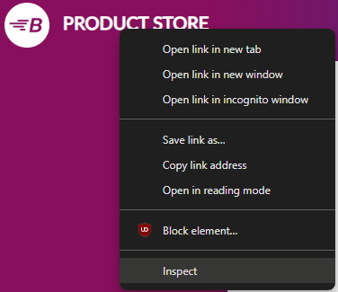
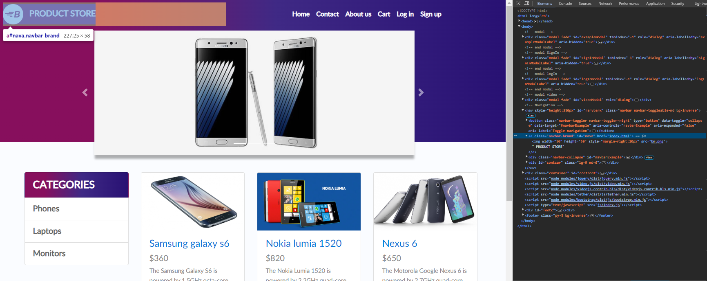

# Grabbing Logo Text From E-Commerce Website

Let's say we want to locate the logo element of this test e-commerce website ([https://www.demoblaze.com/](https://www.demoblaze.com/)) and grab the "Product Store" text:

<figure><figcaption></figcaption></figure>

First, let's import Simple Selenium & initiate the webdriver with our desired startup options:

```python
from simpleseleniumwrapper import WebDriver as SimpleSelenium

#Initiate & start the Chrome webdriver. Data will be saved to the "myAwesomeProfile" profile.
driver=SimpleSelenium("chrome",maximized=True,save_profile=True,profile_name="myAwesomeProfile",save_logs_in_file=True)
```

Visiting the target website is simple:

```python
#Visit the target website
driver.visit('https://www.demoblaze.com/')
```

Now visit the target website on your normal web browser, right click the logo element, & click "inspect":

<figure><figcaption></figcaption></figure>

This should open the developer tools console. Get familiar with this, since you'll be using dev-tools a lot:

<figure><figcaption></figcaption></figure>

Looking at the \<a> tag, we need to find a reliable attribute to consistently identify this product logo element. The class attribute looks promising, as it has a unique & human-readable value ("navbar-brand"), which is unlikely to change.

<figure><figcaption></figcaption></figure>

Now with Simple Selenium, you can use this class name ("navbar-brand") to locate the logo element:

```python
#Find the element by ID (nava)
logo_element=driver.by_class("navbar-brand")
```

And finally, let's grab the text inside this element:

```python
#Grab text inside this element
print(logo_element.text()) #Returns "PRODUCT STORE"
```

This is the general procedure for reliably locating elements on any webpage. We'll cover more complex examples in the next pages.
